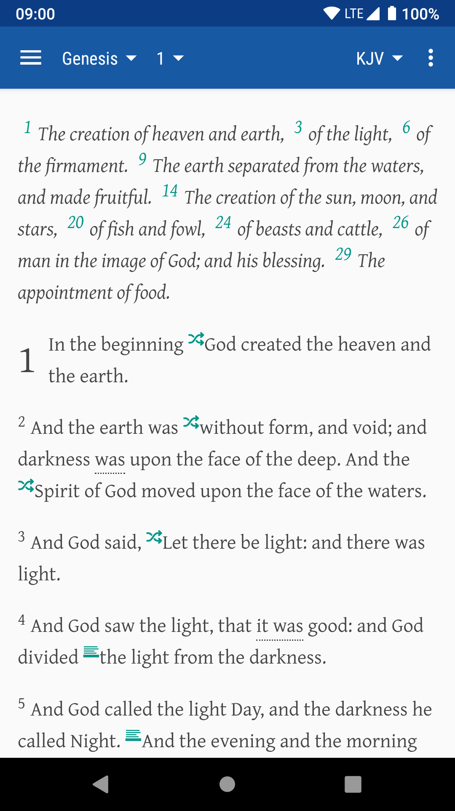

This page describes the "Authorised (King James) Version" in [Dove Bible](https://bible.jianyu.io). Please note, KJV is public Domain outside of the United Kingdom, however, rights in the United Kingdom are vested in the Crown.

The "Authorised (King James) Version" is from [Trinitarian Bible Society](https://tbsbibles.org/), a merge of [Legacy TBS Online Bible](https://tbsdigital.net) and [TBS Online Bible](https://www.tbsonlinebible.com).

### Text Differences
In general, All the text match [TBS Online Bible](https://www.tbsonlinebible.com). The differences between [Legacy TBS Online Bible](https://tbsdigital.net) and [TBS Online Bible](https://www.tbsonlinebible.com):

#### case
- Exod 16:12, "the Lord" to "the LORD"

#### format
- Num 30:3, "bind<i>&#160;</i>herself by a bond" to "bind<i>&#160;herself</i> by a bond" ("herself" marked as added)
- Num 33:53, "<i>the in</i><i>hab</i><i>i</i><i>tants </i>of the land" to "<i>the inhabitants of</i> the land" ("of" marked as added)

#### word
- Gal 1:4, "deliver usfrom" to "deliver us from"
- Phil 4:19, "in glory by Christ Jesus" to "in glory by Christ Jesus." (add stop)
- 1Thess 2:14, "Judare" to "Judæa are"
- 1Tim 1:20, "Hymenand Alexander" to "Hymenæus and Alexander"
- 2Tim 2:17, "Hymenand Philetus" to "Hymenæus and Philetus"

#### remove hypen
1. 2Sam 18:13, "thy-self"
1. 2Kgs 20:13, "oint-ment" and "noth-ing"
1. 2Kgs 21:16, "in-nocent"
1. 2Kgs 22:14, "Sha-phan"
1. 1Chr 11:27, "He-lez"
1. 1Chr 12:30, "Ephra-im"
1. 1Chr 15:12, "Le-vites"
1. 1Chr 15:24, "Jehosh-aphat", "Ama-sai"
1. 2Chr 12:12, "him-self"
1. 2Chr 20:37, "Be-cause"
1. 2Chr 30:17, "sanc-tified"
1. Ezra 3:3, "be-cause" and "coun-tries"
1. Esth 6:5, "stand-eth"
1. Esth 9:28, "fam-ily"
1. Job 9:33, "days-man"
1. Ps 65:6, "set-teth"
1. Ps 89:51, "where-with"
1. Ps 106:24, "pleas-ant"
1. Ps 119:32, "com-mandments"
1. Ps 128:1, "walk-eth"
1. Ps 137:7, "chil-dren"
1. Prov 16:26, "labour-eth"
1. Prov 20:23, "abom-ination"
1. Prov 29:22, "abound-eth"

#### case of first word of verse 1
In original [Legacy TBS Online Bible](https://tbsdigital.net), the first word of verse 1 is in uppercase, and it's changed to first-character-capitalized in [TBS Online Bible](https://www.tbsonlinebible.com). For example, Genesis 1:

- "IN the beginning"
- "In the beginning"

Dove Bible merge 1175 verses, and keep 14 verses in uppercase as they starts with "LORD" or "O LORD":

1. Ps 3:1
1. Ps 6:1
1. Ps 7:1
1. Ps 8:1
1. Ps 15:1
1. Ps 38:1
1. Ps 85:1
1. Ps 88:1
1. Ps 94:1
1. Ps 131:1
1. Ps 132:1
1. Ps 139:1
1. Ps 141:1
1. Isa 25:1

Please note, [Ps 90:1](https://www.tbsonlinebible.com/#en_PSA_90) startswiths "Lord".

### Technical Differences

#### style differences
For added words, Dove Bible prefer added(with dotted underline) to <i>added</i>. It's like this (Gen 1:2):

- darkness <i>was</i> upon the face of the deep
- darkness <i style="border-bottom: 1px dotted; font-style: normal">was</i> upon the face of the deep (invisible in GitHub)

And in original [Legacy TBS Online Bible](https://tbsdigital.net), letter is used for cross reference, and number is used for footnote. Dove Bible use icon and omit the letter or number.

#### link differences

In the summary of following chapters, the verse number 1 is not linked in original [Legacy TBS Online Bible](https://tbsdigital.net):

- Ps 10
- Ps 11
- Ps 16
- Ps 98
- Lam 2
- Zech 14

#### footnote differences

In following verses, in original [Legacy TBS Online Bible](https://tbsdigital.net), it's cross reference, however, as the content seems not cross reference, it's modified to footnote:

- 2Chr 18:9, j: Or, <i>floor.</i> 
- Ezra 9:9, v: Heb. to set up. 
- 1Tim 1:6, v: Or, <i>not aiming at.</i> 

### Why KJV from TBS?

There are many digital KJV, however, none of them are same:

- [KJV](https://www.biblegateway.com/versions/King-James-Version-KJV-Bible/) on BibleGateway.com
- [AKJV](https://www.biblegateway.com/versions/Authorized-King-James-Version-AKJV-Bible/), on BibleGateway.com
- [BRG](https://www.biblegateway.com/versions/BRG-Bible/) on BibleGateway.com, Blue Red and Gold Letter Edition of KJV
- [KJV](https://www.biblegateway.com/versions/BRG-Bible/) on bibles.org, British and Foreign Bible Society
- [KJV](https://www.bible.com/versions/1), YouVersion

And none of them contain cross references. When I read [King James Version](https://en.wikipedia.org/wiki/King_James_Version) on Wikipedia, then I read [Settings of the King James Bible](http://www.ourkjv.com/KJB.pdf) from [Our KJV](http://www.ourkjv.com/), then I know [Trinitarian Bible Society](https://tbsbibles.org/), and choose KJV from Trinitarian Bible Society.
